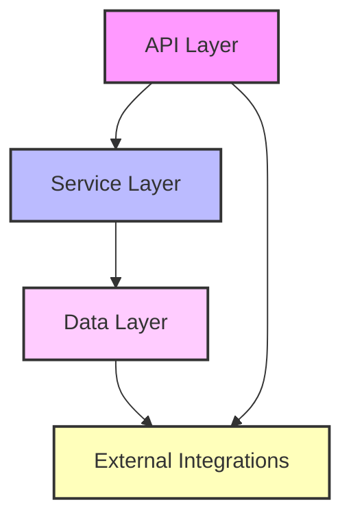

```mermaid
  graph TD;
      API_Layer["API Layer"] --> Service_Layer["Service Layer"];
      Service_Layer --> Data_Layer["Data Layer"];
      Data_Layer --> External_Integrations["External Integrations"];
      API_Layer --> External_Integrations;
      style API_Layer fill:#f9f,stroke:#333,stroke-width:2px;
      style Service_Layer fill:#bbf,stroke:#333,stroke-width:2px;
      style Data_Layer fill:#fcf,stroke:#333,stroke-width:2px;
      style External_Integrations fill:#ffb,stroke:#333,stroke-width:2px;
```